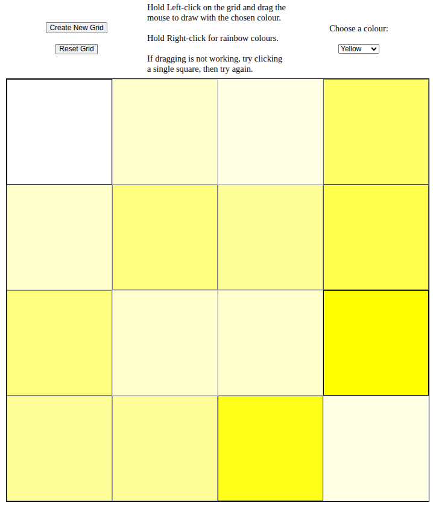
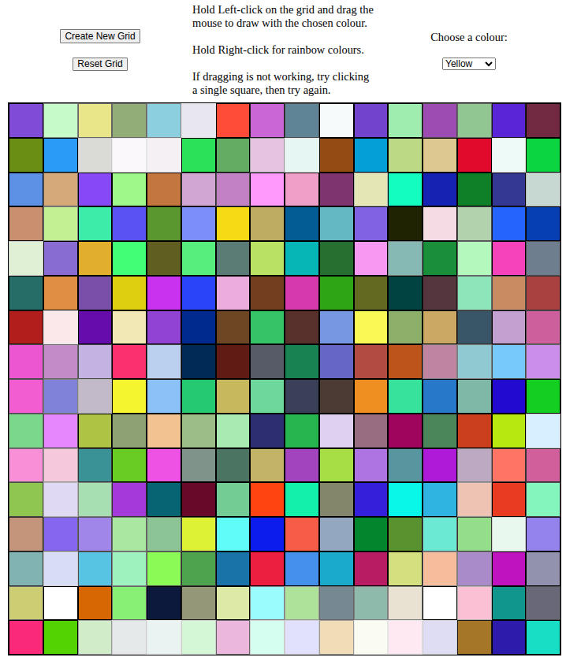

# Etch-a-Sketch

An interactive drawing grid built with JavaScript, inspired by the classic Etch-a-sketch toy.

## Description
This project was completed as part of The Odin Project to practice dynamic DOM manipulation, variable grid generation, and user interaction through event listeners.

## Features
- Adjustable grid size
- Left and Right click drawing interaction
- Grid reset to default
- Responsive layout 

## Tech Used
- HTML
- CSS
- JavaScript

## What I Learned
- Creating and updating elements dynamically using the DOM
- Using event listeners efficiently
- Handling user input and UI state
- Improving layout and responsiveness with CSS
- Finding solutions under constraints, as required to use ONLY flexbox and not grid.

## Future Work
When I come back to this project, I want to make it truly responsive, by implementing touch support for mobile. Currently, this project is desktop only, since you can't right-click on mobile.

## How to Run
1. Clone the repository, or download the folder
2. Open 'index.html' in your preferred browser